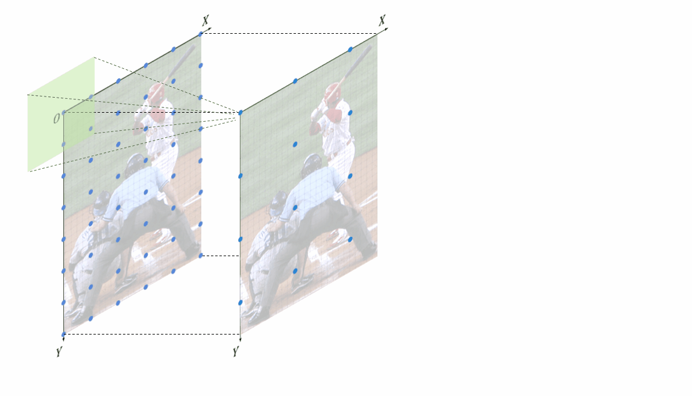
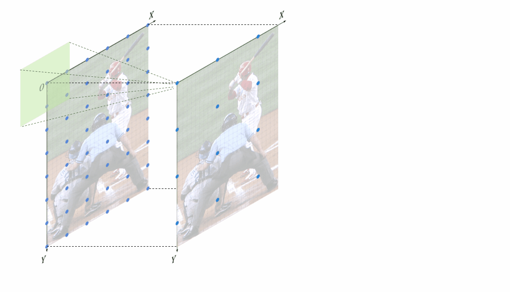
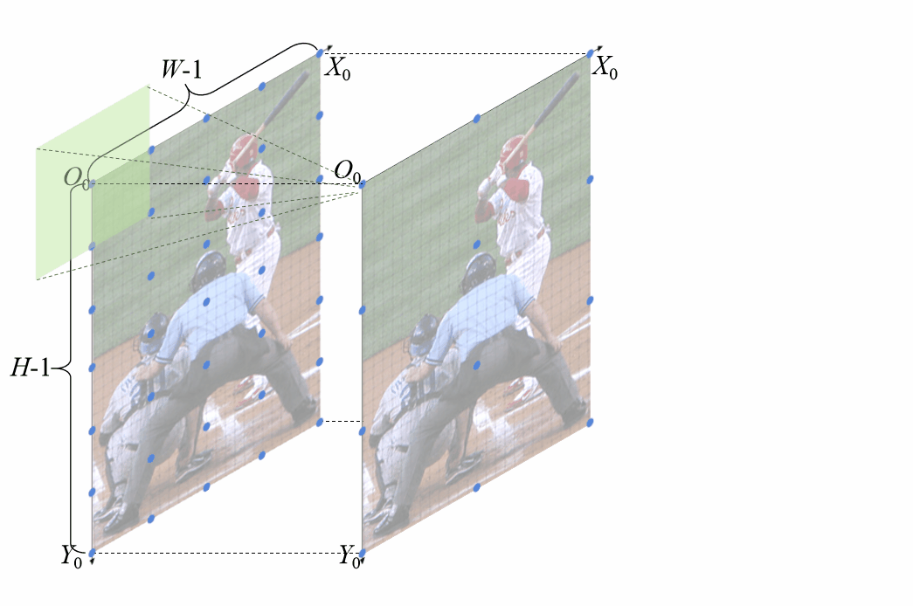
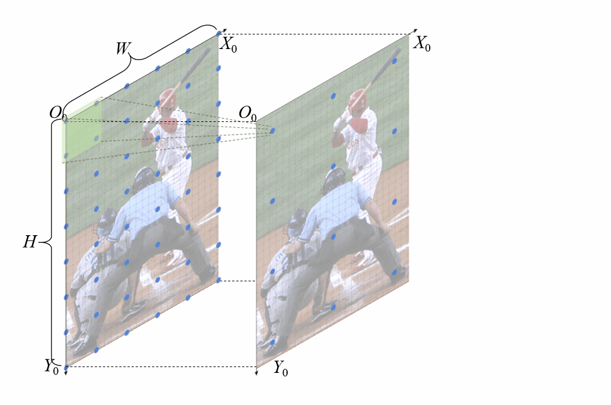

# Unbiased-Feature-Position-Alignment-for-Human-Pose-Estimation

## Dynamic visualization of feature postion misalignment
We illustrate the different feature position misalignments induced by two interpolation strategies. Their difference focus on the implementation of inpterplation during upsampling.

This gif dynamically visualize how the feature position misalignment generates when using corner-aligned interpolation.

This gif dynamically visualize how the feature position misalignment generates when using corner-unaligned interpolation.

## Dynamic visualization of unbiased feature postion alignment
This gif dynamically visualize how the proposed unbiased feature position alignment works to solve the misalignment problem when using corner-aligned interpolation.

This gif dynamically visualize how the proposed unbiased feature position alignment works to solve the misalignment problem when using corner-unaligned interpolation.
