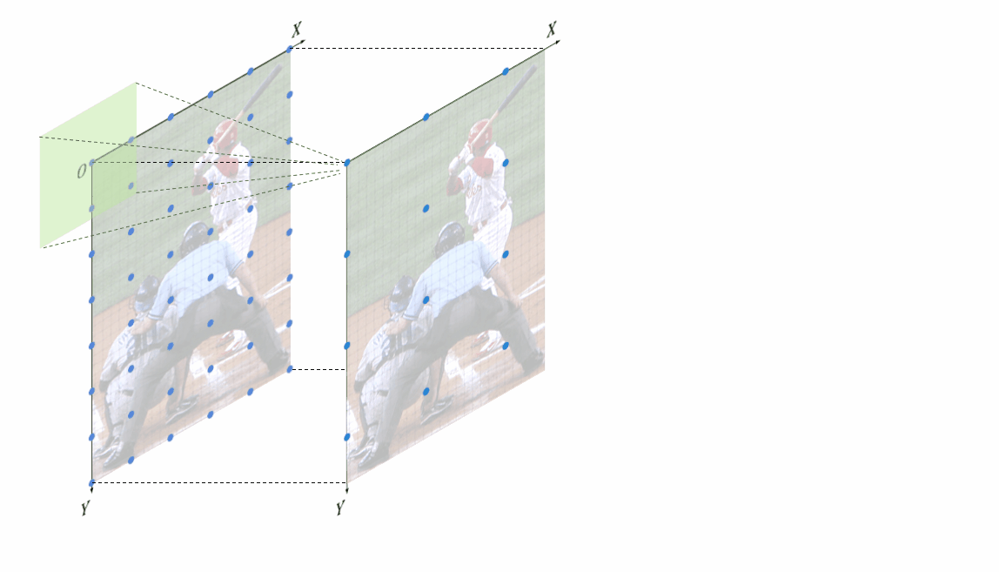
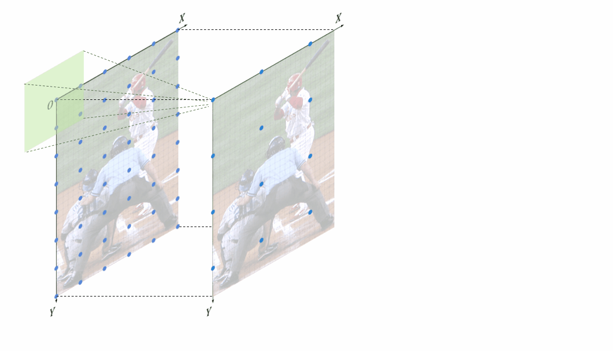
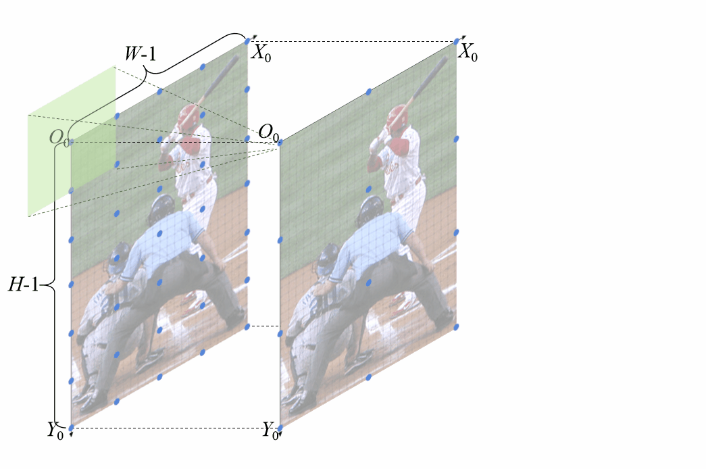
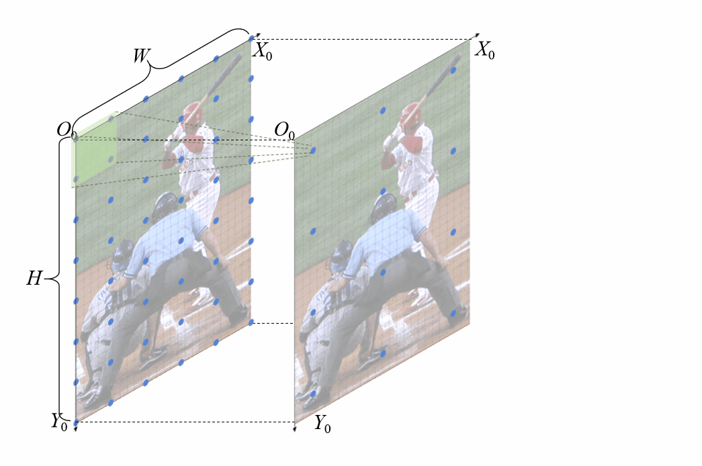

# Unbiased-Feature-Position-Alignment-for-Human-Pose-Estimation

Serving as a model-agnostic plug-in, UFPA significantly improves the performance of a variety of state-of-the-art human pose estimation models!

## News
- accepted by Neurocomputing in 2022

## Introduction

This is an official pytorch implementation of Unbiased Feature Position Alignment for Human Pose Estimation. In this work, we are interested in feature position alignment during multi-feature fusion. Our baseline is DARK pose.

### Dynamic visualization of feature postion misalignment
We illustrate the different feature position misalignments induced by two interpolation strategies. Their difference focus on the implementation of inpterplation during upsampling.

This gif dynamically visualize how the feature position misalignment generates when using corner-aligned interpolation.


This gif dynamically visualize how the feature position misalignment generates when using corner-unaligned interpolation.


## Dynamic visualization of unbiased feature postion alignment
This gif dynamically visualize how the proposed unbiased feature position alignment works to solve the misalignment problem when using corner-aligned interpolation.


This gif dynamically visualize how the proposed unbiased feature position alignment works to solve the misalignment problem when using corner-unaligned interpolation.


## Quick start
### Installation
1. Install Pytorch and other dependencies
```
pip install -r requirements.txt
```

2. Make libs
```
cd ${POSE_ROOT}/lib
make
```

3. Install COCOAPI
```
# COCOAPI=/path/to/clone/cocoapi
git clone https://github.com/cocodataset/cocoapi.git $COCOAPI
cd $COCOAPI/PythonAPI
# Install into global site-packages
make install
# Alternatively, if you do not have permissions or prefer
# not to install the COCO API into global site-packages
python3 setup.py install --user
```

4. Create outpu and log folder
```
mkdir output 
mkdir log
```

### Train on COCO dataset
```
python tools/train.py \
    --cfg experiments/coco/hrnet/w32_128x96_adam_lr1e-3.yaml \
```